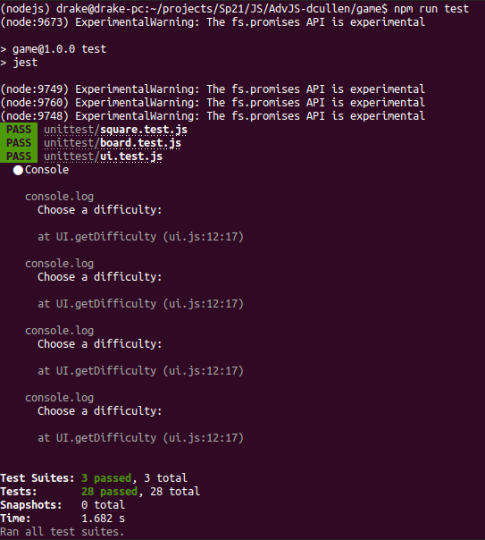

# Project 1 - Game Project

## I created [Minesweeper](https://github.com/DrakeCullen/AdvJS-dcullen/tree/main/game/imgs) in the terminal using NodeJS.
### My game satisfies all of the requirements and adds "bells and whistles" such as changing the color of a flaged element. The game keeps track of user's and their stats.
 

### To install the game, clone this github repository. Next, run "npm install". You can either run the unit tests by typing "npm run test" or play the game by running "node main.js".

 

### In order to win, you must flag all of the squares containing bombs.

 

### All my unit tests passed!

 

### Learn more about the game and see it working by clicking<b> [here](https://github.com/DrakeCullen/AdvJS-dcullen/tree/main/game/imgs)!</b>

 

