# Minesweeper in action

### Begin by choosing a difficulty: 
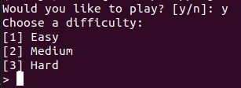

 
 

### Here are what the difficulties look like. Easy - 6 X 6, Medium 8 X 8, Hard 12 X 12: 
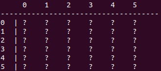
 
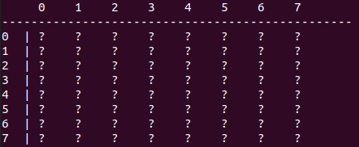
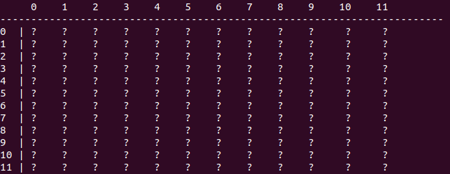

 
 

### Either register as a new player or type in your username: 
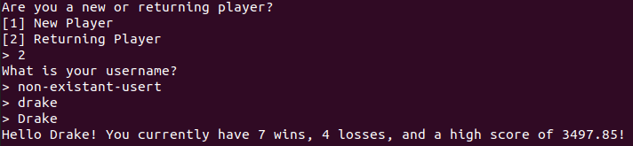
 
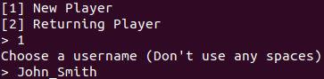

 
 

### You can choose to flag an element: 
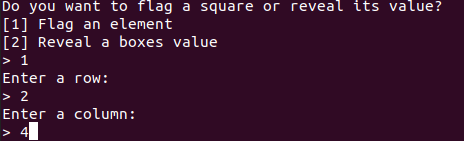
 
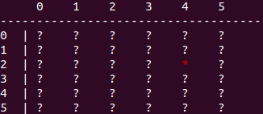

 
 

### Or you can reveal an elements value: 
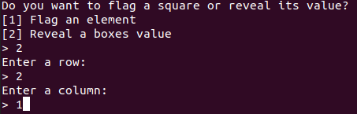
 
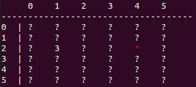

 
 

### If you reveal a bomb, you lose!
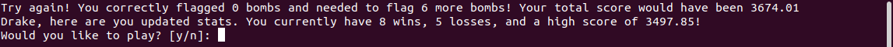

 
 

### If you succesfully flag all the bombs, you win! Top 5 scores make it on the leaderboard!: 
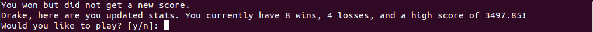

 
 

### Here is a video of me playing:
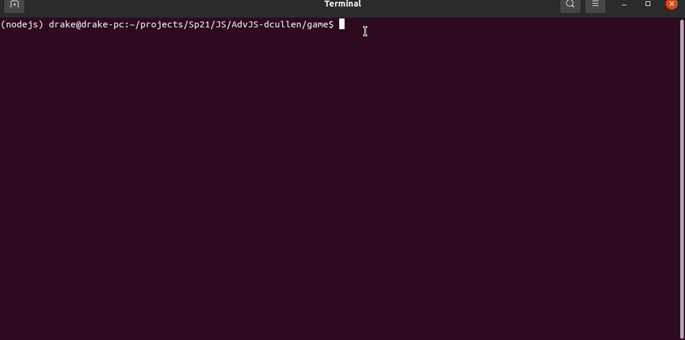