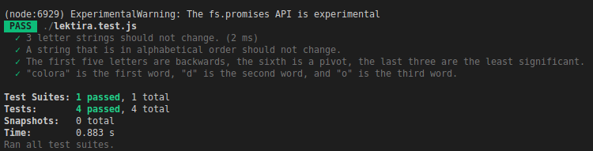
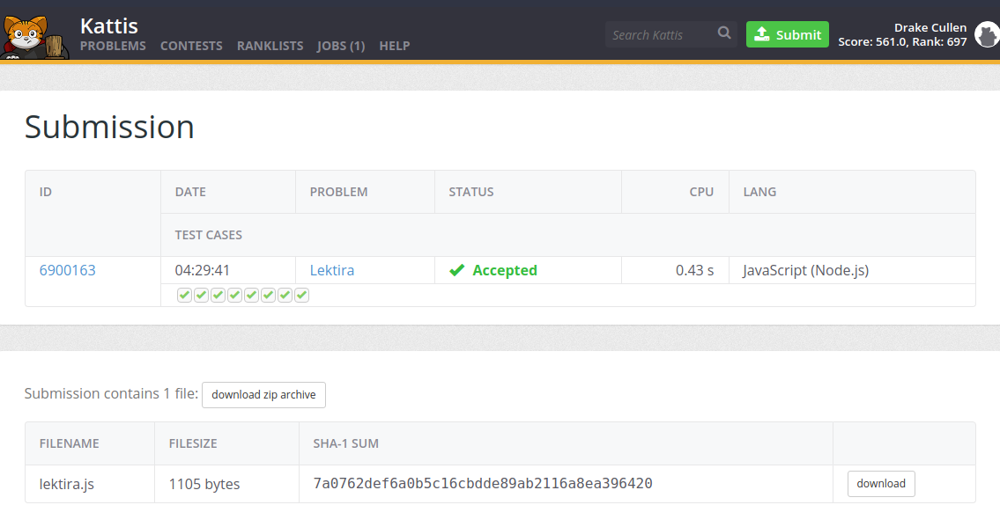
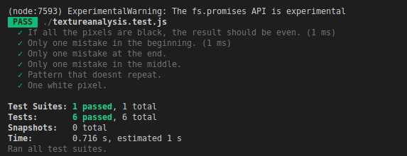
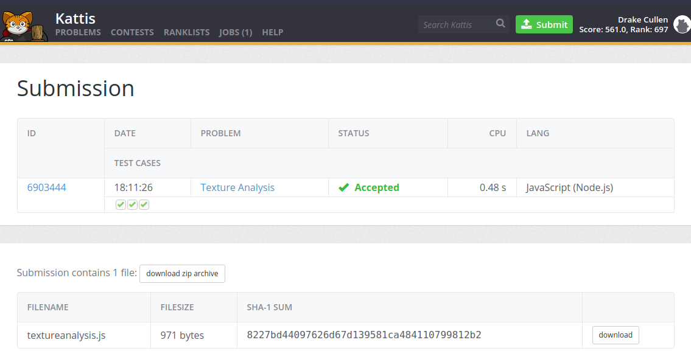

# Project 2 - Kattis Problems

### Both problems have a difficulty higher than 1.7. Furthermore, each problem has at least 3 automated test cases. All the criteria is met, so I believe that I earn a score of 100%.

 

## Problem #1 - [Lektira](https://github.com/DrakeCullen/AdvJS-dcullen/tree/main/kattis/lektira) (3.0 Difficulty)
 

 

## Problem #2 - [Texture Analysis](https://github.com/DrakeCullen/AdvJS-dcullen/tree/main/kattis/textureanalysis) (2.7 Difficulty)
 

